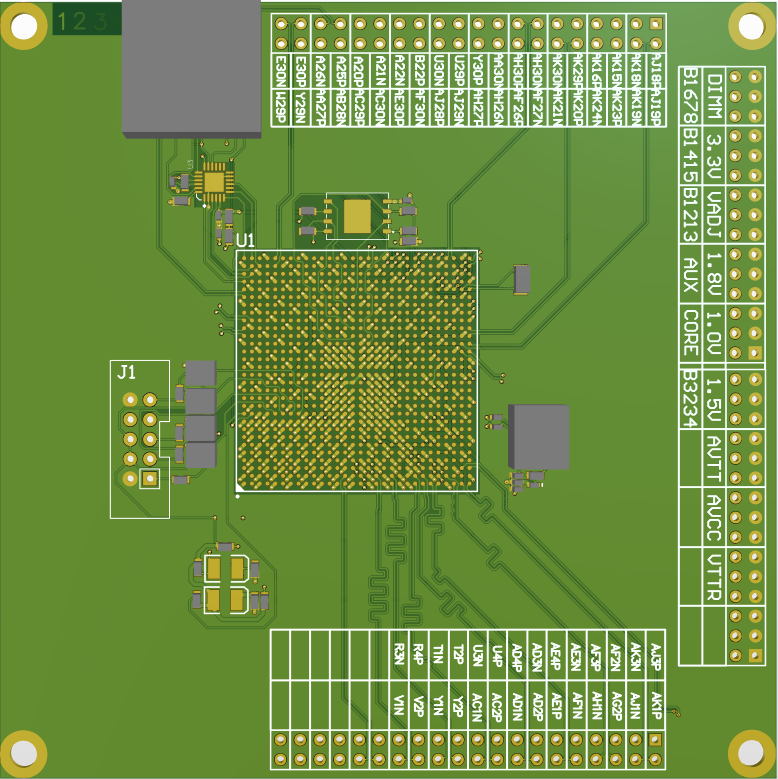
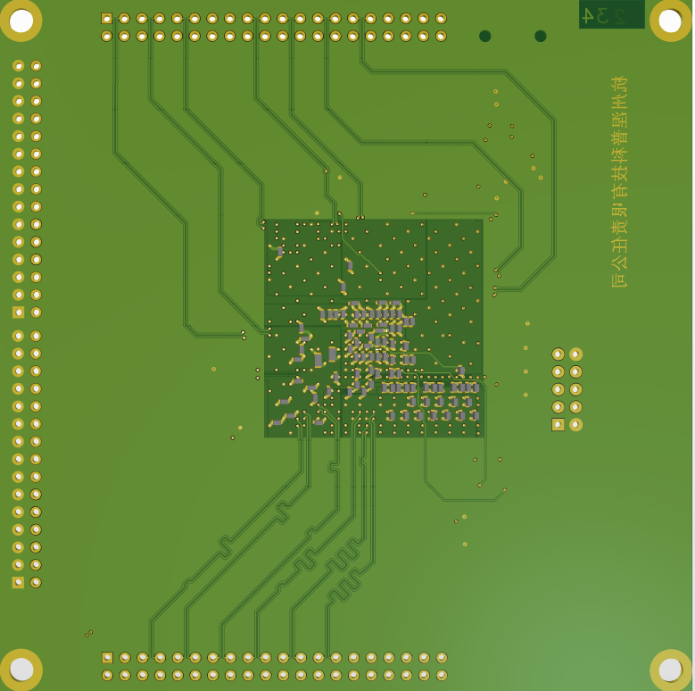
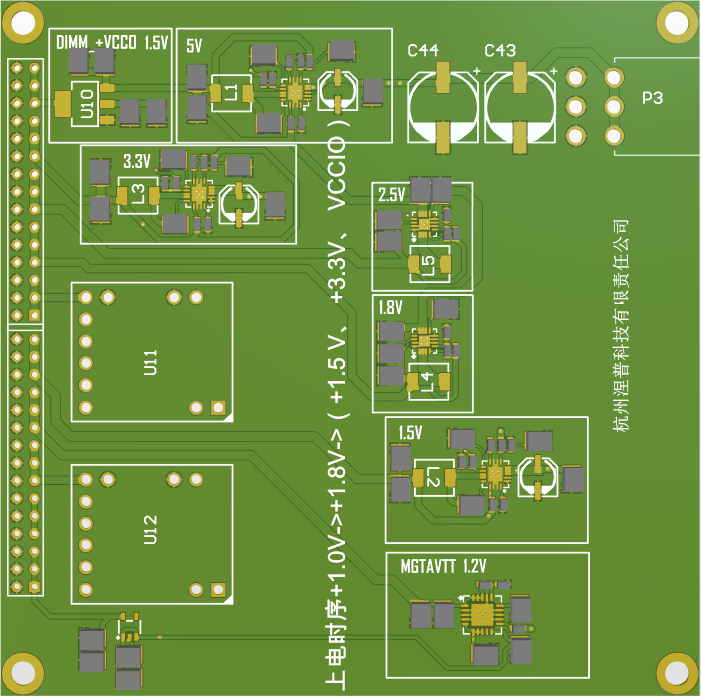
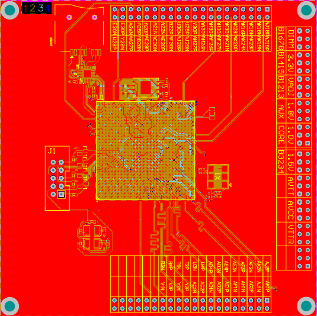

# 开源Xilinx Kintex-7 XC7K325T IO功能验证板项目
**注意：这是一个有待验证的开源硬件**
> 本作品采用<a rel="license" href="http://creativecommons.org/licenses/by/4.0/">知识共享署名 4.0 国际许可协议</a>进行许可。
>## PCB板简介：分为核心板和供电板
>供电板
>1. 尺寸10cmX10cm
>2. 供电板布线层分布 GND +12V
>3. 设计软件为Altium Desinger20.0
>4. 供电部分设计：1.0V核心电压、1.2V、1.5V、1.8V、3.3V、5.0V供电电压，其中核心供电电流为32A采用两块TI PTH08T220WAD
>5. 供电板上电时序 ：+1.0V->+1.8V->（+1.5 V、 +3.3V）请严格按照xilinx官方手册设计上电时序，该项目供电模块没有经过验证，仅用于参考

>核心板
>1. 尺寸10cmX10cm
>2. 核心板布线层分布 signal gnd power signer
>3. 设计软件为Altium Desinger20.0
>4. FPGA器件型号 XC7K325T FFG900
>5. 核心板共引出34个差分对其中14个为等长差分，IO以及BANK分布，BANK供电分布请参考原理图
>6. 提供一个Micro SD卡插槽带电平转换芯片
>7. 提供两个用户微动开关管教定义请参考原理图
>8. 提供10PIN JTAG调试接口
>9. 提供一个差分晶振接口
>10. 注意核心板中滤波电容设计未严格按xilinx手册设计，仅供参考
>11. 提供128M SPI FLASH
>
>3D渲染图片

>联系邮箱：1399109998@qq.com

>核心板起初设计用于数字加密货币的挖掘以及算法验证，由于某些原因在算法设计上有困难故暂时搁置，有合作开发想法请联系我。